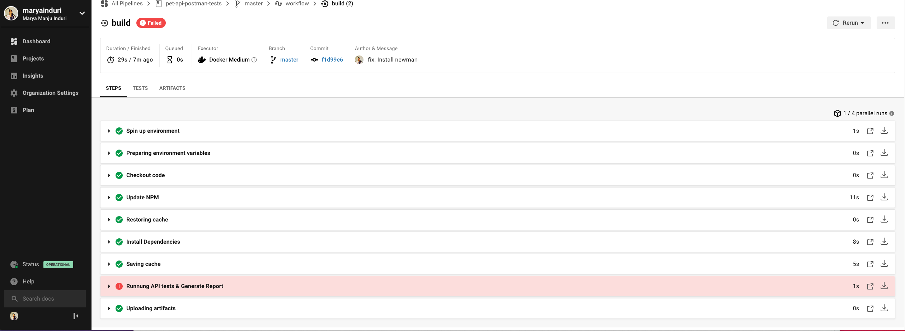

# pet-api-tests

This repository contains [Pet API](https://petstore.swagger.io/#/) REST API tests using [Postman](https://www.postman.com/) and command line [Newman](https://github.com/postmanlabs/newman)

# How to run tests

## Installation
The easiest way to install Newman is using NPM. If you have Node.js installed, it is most likely that you have NPM installed as well.   

```npm install -S newman``` 

```npm install -S newman-reporter-htmlextra```

## Usage

#### Using Npm

```npm run dev:test```

## Reporting

Install [Newman HTML reporter](https://www.npmjs.com/package/newman-reporter-htmlextra)

```npm install -S newman-reporter-htmlextra```

> HTML report generated under newman folder


> HTML report generated in Circle CI




## contact
[marya.induri@gmail.com](marya.induri@gmail.com)